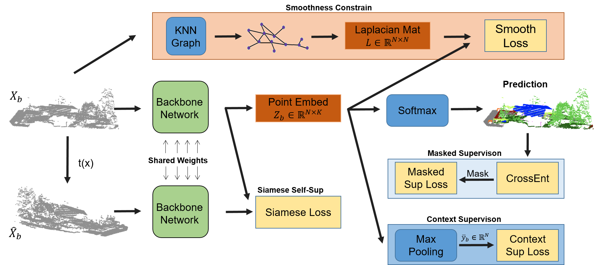
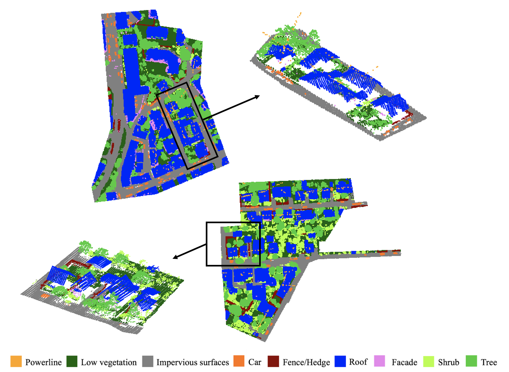

This is the source code for our paper <b></b>.


# A Novel Semi-Supervised Method for Airborne LiDAR Point Cloud Classification


Introduction
------------
This is the source code for our paper **A Novel Semi-Supervised Method for Airborne LiDAR Point Cloud Classification**

Paper link: ***

Our method achieves an overall accuracy of 83.3% and an average F1 score of 69.0% on ISPRS Vaihingen dataset with only 10% labeled samples. 

Network Architecture
--------------------
The architecture of our proposed model is as follows



Results on ISPRS Vaihingen dataset
--------------------


## Installation
In our experiment, All the codes are tested in Python 3.6 (If you use Python 2.7, please add some system paths), CUDA 10.1.

Install TensorFlow (We use v1.14).
Install other python libraries like h5py
Compile TF operator (Similar to PointNet++). Firstly, you should find Tensorflow include path and library paths.
    import tensorflow as tf
    # include path
    print(tf.sysconfig.get_include())
    # library path 
    print(tf.sysconfig.get_lib())
Then, change the path in all the complie file, like tf_utils/tf_ops/sampling/tf_sampling_compile.sh Finally, compile the source file, we use tf_sampling as example.

    cd tf_utils/tf_ops/sampling
    chmod +x tf_sampling_compile.sh
    ./tf_sampling_compile.sh

* Clone this repo
```
git clone https://github.com/lixiang-ucas/SemiALS-Net.git

```
## Dataset
* Download the ISPRS Vaihinge dataset from (http://www2.isprs.org/commissions/comm3/wg4/3d-semantic-labeling.html)
* Download the IEEE GRSS Data Fusion Contest 2018 dataset from (http://www.grss-ieee.org/community/technical-committees/data-fusion/2018-ieee-grss-data-fusion-contest/)


## Training & Testing

python train_weakly.py


## Acknowledgements
Part of the code is borrowed from [DANCE-NET](https://github.com/lixiang-ucas/DANCE-NET)


## Citation

If you find this useful in your research, please consider citing:

  @article{li2020dance,
  title={DANCE-NET: Density-aware convolution networks with context encoding for airborne LiDAR point cloud classification},
  author={Li, Xiang and Wang, Lingjing and Wang, Mingyang and Wen, Congcong and Fang, Yi},
  journal={ISPRS Journal of Photogrammetry and Remote Sensing},
  volume={166},
  pages={128--139},
  year={2020},
  publisher={Elsevier}
}
